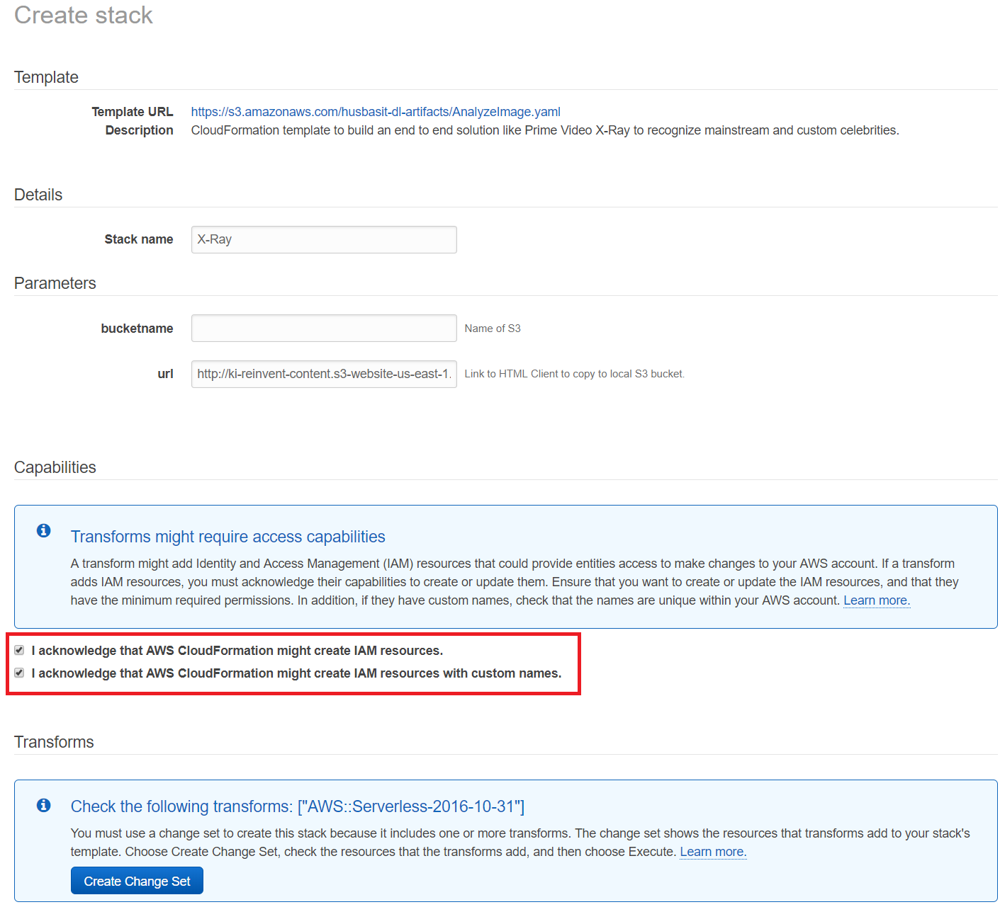

# X-Ray
In this module we will build an end to end solution like Prime Video X-Ray to recognize mainstream and custom celebrities. We use RecognizeCelebrities and SearchFacesByImage APIs to recognize mainstream and custom celebrities.

## Pre-requisites
This module requires completion of previous modules:
 - [Celebrity Recognition](https://github.com/darwaishx/celebrity-recognition/tree/master/1-celebrity-recognition)
 - [Recognize Custom Celebrities](https://github.com/darwaishx/celebrity-recognition/tree/master/2-recognize-custom-celebrities)

## Deploy Solution
In this step we will deploy the solution using CloudFormation template. This CloudFormation template will perform following actions:

- Create and deploy REST APIs using AWS API Gateway. It will provide public endpoints to accept request from Client.
- Create Lambda function to interface with AWS Rekognition to recognize mainstream and custom celebrities.
- Create a S3 bucket, copy required files to host HTML based client to test this solution.

1. Click on **Launch Stack** button below to launch CloudFormation template in US East AWS region.

Region| Launch
------|-----
US East (N. Virginia) | 

2. Under Create stack, check both checkboxes for "I acknowledge that AWS CloudFormation might create IAM resources with custom names" and "I acknowledge that AWS CloudFormation might create IAM resources.". Click **Create Change Set** button.

3. Click on **Execute** button.

4. You should now see the screen with status **CREATE_IN_PROGRESS**. Click on the **Stacks** link in the top navigation to see current CloudFormation stacks.

5. Click on the checkbox next to the stack to see additional details below.

6. Wait until CloudFormation stack status changes to  **CREATE_COMPLETE**.

7. Click on **Outputs** tab to view the details of Lambda function, API Gateway APIs and Client HTML file created by CloudFormation.

8. Clink the **bucketURL** link to load the client HTML page hosted from your S3 bucket.

## Modify HTML Client
In this step we will modify the HTML Client to point it to the REST endpoint service we have deployed on API Gateway using CloudFormation.

## Other Steps

## Analyze Images

## Other?

## Completion
You have successfully installed and configured Media Analysis Solution. You then learned how to use managed Machine Learning Application Services to extract metadata from your media files. You also learned how to extend Media Analysis Solution and detect and filter inappropriate content.

## Clean up
Step to clean up resources.
